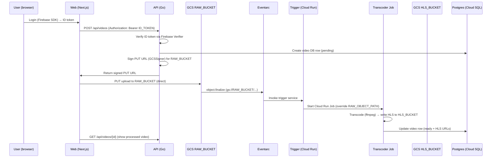
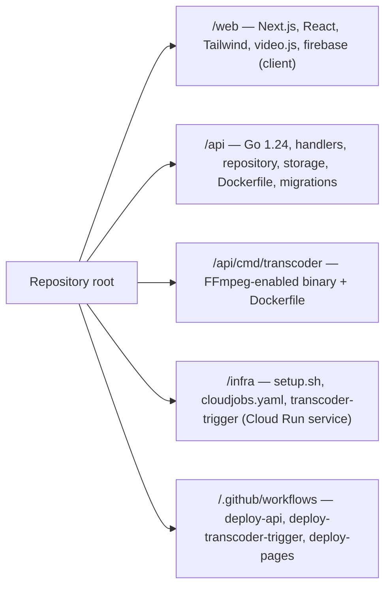

# Архитектура проекта mytube

Кратко:
- Frontend: /web — Next.js 16 + React 19, Tailwind, video.js, Firebase (клиент). Деплой: GitHub Pages (static export).
- Backend: /api — Go 1.24, Dockerfile, развернут на Cloud Run через GitHub Actions; использует Cloud SQL (Postgres) и GCS.
- Транскодер: /api/cmd/transcoder + infra/transcoder-trigger — FFmpeg в контейнере, выполняется как Cloud Run Job, запускается Eventarc -> Trigger.
- Хранение видео: GCS — RAW_UPLOADS_BUCKET (private) для исходников, HLS_BUCKET (public) для HLS/плейлистов (CDN_BASE_URL).
- Авторизация: Firebase Auth (клиент SDK в /web, серверная проверка в /api через auth.NewFirebaseVerifier).
- CI/CD и infra: .github/workflows (deploy-api, deploy-transcoder-trigger, deploy-pages), infra/setup.sh, cloudjobs.yaml.

> Текста минимум — ниже в основном диаграммы mermaid.

---

## Схема: общая архитектура

```mermaid
flowchart LR
  subgraph Client
    U[Пользователь]
  end
  U --> Browser[Next.js (web/) — GitHub Pages]
  Browser -->|ID Token| Firebase[Firebase Auth]
  Browser -->|REST (JWT)| API[API — Go (Cloud Run)]
  API -->|signed URLs| GCS_RAW[GCS: RAW_UPLOADS_BUCKET (private)]
  GCS_RAW -->|object.finalize| Eventarc[Eventarc]
  Eventarc --> Trigger[Transcoder Trigger (Cloud Run)]
  Trigger -->|start job| Transcoder[Transcoder Job (Cloud Run Job, FFmpeg)]
  Transcoder --> GCS_HLS[GCS: HLS_BUCKET (public)]
  Transcoder --> DB[(Postgres — Cloud SQL)]
  API --> DB
  API --> GCS_HLS
  GitHubActions[GitHub Actions] -->|deploy| API
  GitHubActions -->|deploy| Trigger
  GitHubActions -->|deploy| Pages[GitHub Pages (web/out)]
```

---

## Развёртывание (где что работает)

```mermaid
graph TB
  subgraph "Google Cloud Platform"
    direction TB
    CloudRunAPI[Cloud Run — mytube-api]
    CloudRunTrigger[Cloud Run — mytube-transcoder-trigger]
    CloudRunJob[Cloud Run Job — mytube-transcoder]
    GCS_RAW[Cloud Storage — mytube-raw-uploads]
    GCS_HLS[Cloud Storage — mytube-hls-output (public)]
    CloudSQL[(Cloud SQL — Postgres)]
    Eventarc[Eventarc]
    SecretManager[Secret Manager]
  end
  subgraph "CI/CD"
    GHActions[.github/workflows]
    GCR[gcr.io (container registry)]
    Pages[GitHub Pages]
  end
  GHActions --> GCR
  GHActions --> CloudRunAPI
  GHActions --> CloudRunTrigger
  GHActions --> Pages
  CloudRunAPI --> CloudSQL
  CloudRunAPI --> GCS_RAW
  CloudRunAPI --> GCS_HLS
  GCS_RAW --> Eventarc --> CloudRunTrigger --> CloudRunJob --> GCS_HLS
  CloudRunJob --> CloudSQL
  SecretManager -->|DB creds| CloudRunAPI
  SecretManager -->|DB creds| CloudRunJob
```

---

## Поток загрузки и транскодирования (upload → transcode → HLS)



---

## Структура репозитория (коротко)



---

Файлы для подробностей:
- web/package.json — фронтенд зависимости (Next.js, React, Firebase, video.js, Tailwind)
- api/main.go — вход в API (Firebase verifier, GCS signer, маршруты)
- api/internal/storage/gcs.go — генерация signed PUT URL (GCSSigner)
- infra/setup.sh, infra/cloudjobs.yaml — инструкции по развёртыванию transcoder job и bucket'ов
- .github/workflows/deploy-*.yml — CI/CD: deploy-api (Cloud Run), deploy-transcoder-trigger (Cloud Run), deploy-pages (GitHub Pages)

