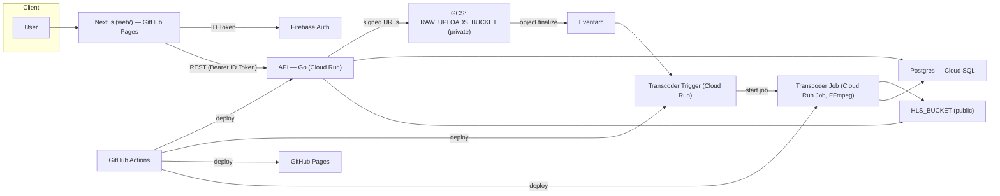
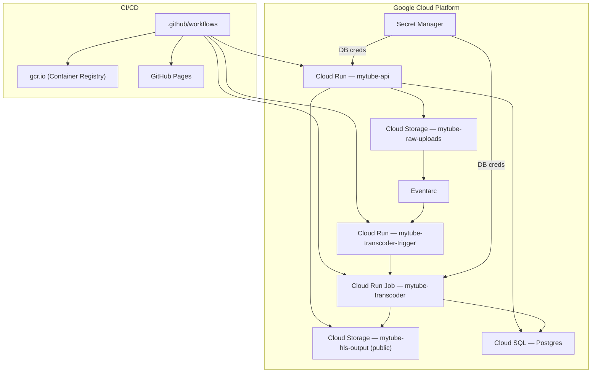
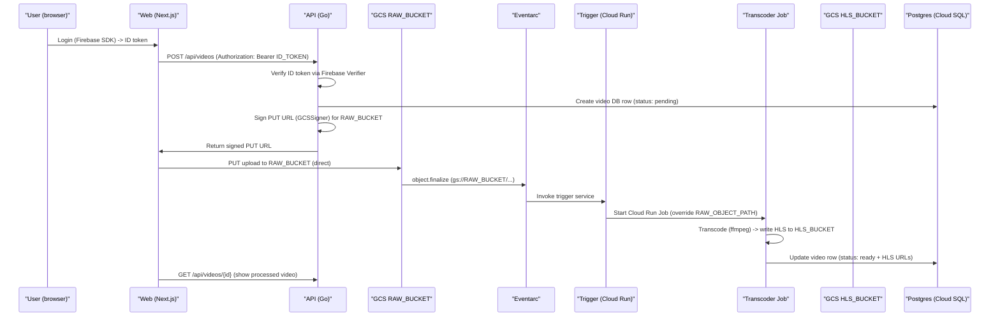
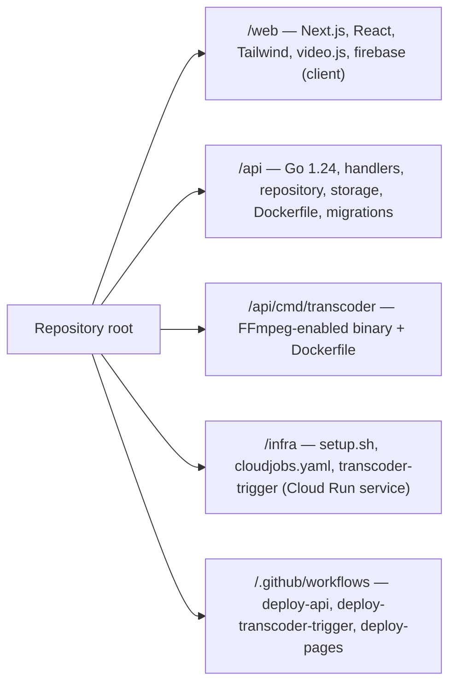

# mytube — Architecture Overview

Short summary:
- Frontend: /web — Next.js 16, React 19, Tailwind CSS, video.js; Firebase client SDK. Deployed as a static export to GitHub Pages via GitHub Actions.
- Backend: /api — Go 1.24, built into a Docker image and deployed to Cloud Run. Uses Cloud SQL (Postgres) and Google Cloud Storage; provides signed upload URLs and verifies Firebase ID tokens server-side.
- Transcoder: /api/cmd/transcoder + infra/transcoder-trigger — FFmpeg in a container; runs as a Cloud Run Job (mytube-transcoder) started by a lightweight trigger service via Eventarc when objects are finalized in the raw uploads bucket.
- Storage: Google Cloud Storage — RAW_UPLOADS_BUCKET (private) for raw uploads, mytube-hls-output (public) for HLS segments/playlists; CDN_BASE_URL used for public delivery.
- Auth: Firebase Authentication (client SDK in /web; server-side verification in /api via auth.NewFirebaseVerifier).
- CI/CD & infra: .github/workflows (deploy-api, deploy-transcoder-trigger, deploy-pages), infra/setup.sh, infra/cloudjobs.yaml.

> Minimal text; most of the README is mermaid diagrams describing the system.

---

## High-level architecture

---

## Deployment topology (where components run)

---

## Upload & transcode flow

---

## Repository layout (short)

---

Key files to inspect:
- web/package.json — frontend dependencies (Next.js, React, Firebase, video.js, Tailwind)
- api/main.go — API entrypoint (Firebase verifier, GCS signer, route registration)
- api/internal/storage/gcs.go — GCSSigner (signed PUT URL generation)
- infra/setup.sh, infra/cloudjobs.yaml — GCP setup and Cloud Run Job spec
- .github/workflows/deploy-*.yml — CI/CD: deploy-api (Cloud Run), deploy-transcoder-trigger (Cloud Run), deploy-pages (GitHub Pages)

